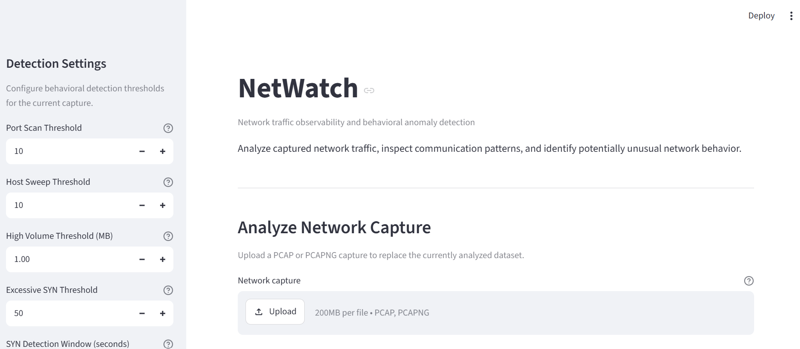
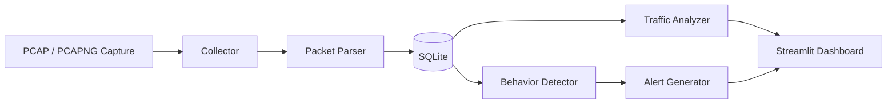

# NetWatch

**Network traffic observability and behavioral anomaly detection for PCAP/PCAPNG captures.**

NetWatch is a Python application for analyzing offline network packet captures. It parses packet metadata with Scapy, stores normalized network observations in SQLite, summarizes network behavior, detects potentially unusual traffic patterns using explainable rules, and presents the results through an interactive Streamlit dashboard.



## Features

- Upload and analyze `.pcap` and `.pcapng` network captures
- Extract IPv4 TCP, UDP, and ICMP packet metadata
- Store normalized network observations in SQLite
- Summarize packet counts, traffic volume, hosts, protocols, and network flows
- Identify top source hosts by packet count and traffic volume
- Detect behavioral network anomalies using configurable thresholds
- Generate severity-classified, human-readable alerts
- Explore results through an interactive Streamlit dashboard
- Preserve the previous dataset if capture processing fails
- Automated test coverage for parsing, storage, analysis, detection, alerting, and capture ingestion

## Architecture



NetWatch separates packet collection, parsing, persistence, analysis, detection, alert generation, and presentation into individual modules.

## Detection Rules

NetWatch currently implements four explainable behavioral detection rules.

| Detection | Behavior |
| --- | --- |
| **Port Scan** | Detects a source contacting an unusually high number of TCP destination ports |
| **Host Sweep** | Detects a source contacting an unusually high number of destination hosts |
| **High-Volume Flow** | Detects a directional network flow exceeding a configurable traffic-volume threshold |
| **Excessive SYN Activity** | Detects bursts of TCP SYN packets within a configurable time window |

Detection thresholds can be adjusted directly from the dashboard.

These rules identify potentially unusual behavior. An alert is evidence of a traffic pattern matching a configured heuristic, not proof that the activity is malicious.

## Traffic Analysis

For each imported capture, NetWatch can summarize:

- Total IPv4 packets
- Total observed traffic volume
- Unique source and destination hosts
- Protocol distribution
- Top source hosts by packet count
- Top source hosts by traffic volume
- Directional network flows
- Packet and byte counts per flow
- Flow duration

A network flow is represented using the directional 5-tuple:

```text
source IP
destination IP
source port
destination port
protocol
```

## Capture Import and Reliability

Uploaded captures are processed using a transactional import workflow.

NetWatch reads and validates the capture before replacing the current dataset. Database deletion and insertion operations then occur within the same SQLite transaction.

If processing succeeds:

```text
Read capture
    ↓
Clear previous observations
    ↓
Parse and insert new observations
    ↓
Commit
```

If processing fails:

```text
Processing error
    ↓
Rollback
    ↓
Previous dataset remains available
```

This prevents a failed import from leaving the database partially updated.

## Tech Stack

- **Python**
- **Scapy** — packet capture parsing
- **SQLite** — network observation storage
- **Streamlit** — interactive dashboard
- **pytest** — automated testing
- **Git / GitHub** — version control

## Installation

### 1. Clone the repository

```bash
git clone <repository-url>
cd netWatch
```

### 2. Create a virtual environment

```bash
python -m venv .venv
```

Activate it on Windows PowerShell:

```powershell
.venvScriptsActivate.ps1
```

On macOS/Linux:

```bash
source .venv/bin/activate
```

### 3. Install NetWatch

Install NetWatch and the development dependencies:

```bash
pip install -e ".[dev]"
```

## Usage

Start the dashboard:

```bash
streamlit run src/netwatch/dashboard.py
```

Then:

1. Open the Streamlit dashboard in your browser.
2. Upload a `.pcap` or `.pcapng` network capture.
3. Select **Analyze Capture**.
4. Review traffic statistics, network flows, and generated security alerts.
5. Adjust detection thresholds from the sidebar to explore different behaviors.

Packet captures can be created with tools such as Wireshark and then analyzed offline with NetWatch.

> **Privacy note:** Packet captures may contain sensitive network information. NetWatch does not include captured traffic in this repository, and PCAP/PCAPNG files are excluded from Git.

## Testing

NetWatch currently includes **23 automated tests** covering:

- TCP, UDP, and ICMP packet parsing
- Non-IPv4 packet handling
- Traffic summaries and empty datasets
- Network flow aggregation
- Port scan detection
- Host sweep detection
- High-volume flow detection
- Time-window SYN activity detection
- Alert generation and severity boundaries
- Database observation clearing
- Successful capture imports
- Transaction rollback when capture processing fails

Run the test suite with:

```bash
pytest -v
```

## Project Structure

```text
netWatch/
├── docs/
│   └── images/
│       └── dashboard.png
├── src/
│   └── netwatch/
│       ├── __init__.py
│       ├── alerts.py
│       ├── analyzer.py
│       ├── collector.py
│       ├── dashboard.py
│       ├── detector.py
│       ├── parser.py
│       └── storage.py
├── tests/
│   ├── test_alerts.py
│   ├── test_analyzer.py
│   ├── test_collector.py
│   ├── test_detector.py
│   ├── test_parser.py
│   └── test_storage.py
├── data/
├── .gitignore
├── pyproject.toml
├── pytest.ini
├── requirements.txt
└── README.md
```

## Design Decisions

### Explainable Detection

NetWatch uses rule-based behavioral detection rather than treating alerts as definitive classifications. This keeps detection logic transparent and makes it possible to understand why an alert was generated.

### Configurable Thresholds

Detection thresholds can be changed from the dashboard so different captures can be analyzed without modifying source code.

### Transactional Capture Imports

Dataset replacement is atomic. A failed capture import rolls back rather than leaving the database empty or partially populated.

### Directional Flows

Network flows are currently represented directionally. Traffic from host A to host B and traffic from host B to host A are treated as separate flows.

### Offline Analysis

NetWatch focuses on offline PCAP/PCAPNG analysis rather than live packet capture. This keeps capture acquisition separate from analysis and makes the application easier to test and reproduce.

## Current Limitations

- IPv4 traffic is analyzed; IPv6 packets are currently skipped.
- Network flows are directional rather than combined into bidirectional conversations.
- Detection rules are heuristic and may produce false positives.
- Alert severity boundaries are currently defined internally rather than configured separately through the dashboard.
- NetWatch analyzes offline captures and does not currently perform live network monitoring.

## Future Improvements

Potential future extensions include:

- IPv6 packet analysis
- Live packet capture
- Bidirectional flow aggregation
- Additional time/rate-based detection rules
- Configurable alert-severity boundaries
- Exportable analysis reports
- Historical comparison between multiple captures

## Disclaimer

NetWatch is an educational network analysis project. Its behavioral alerts are intended to assist traffic investigation and should not be interpreted as definitive evidence of malicious activity.

